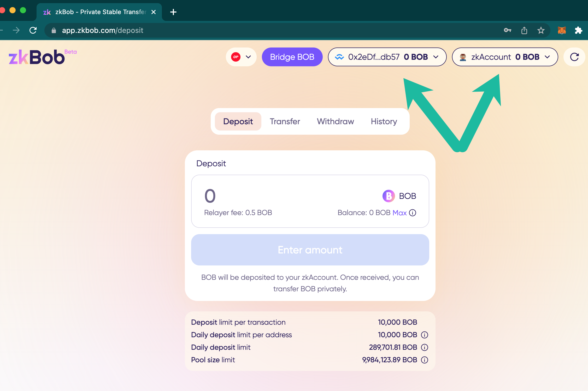
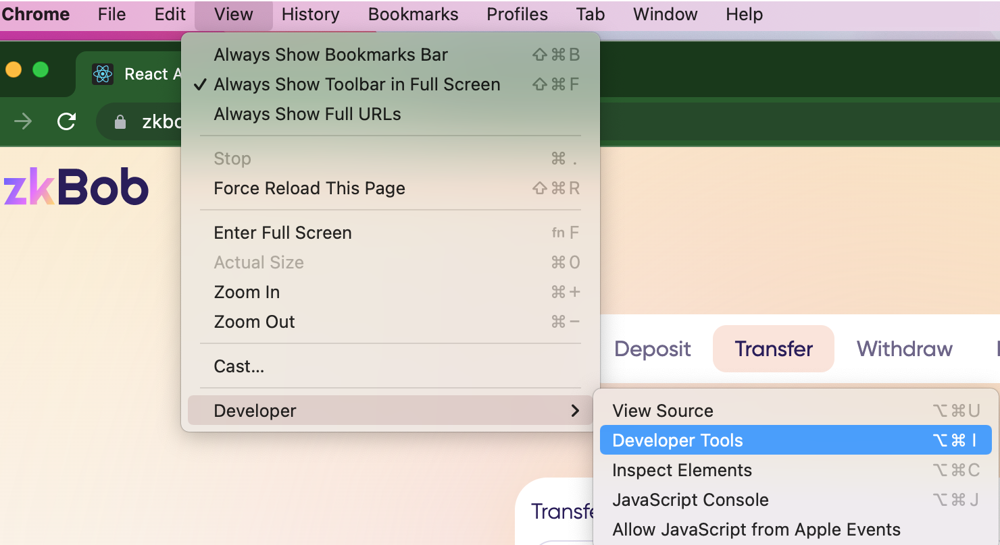
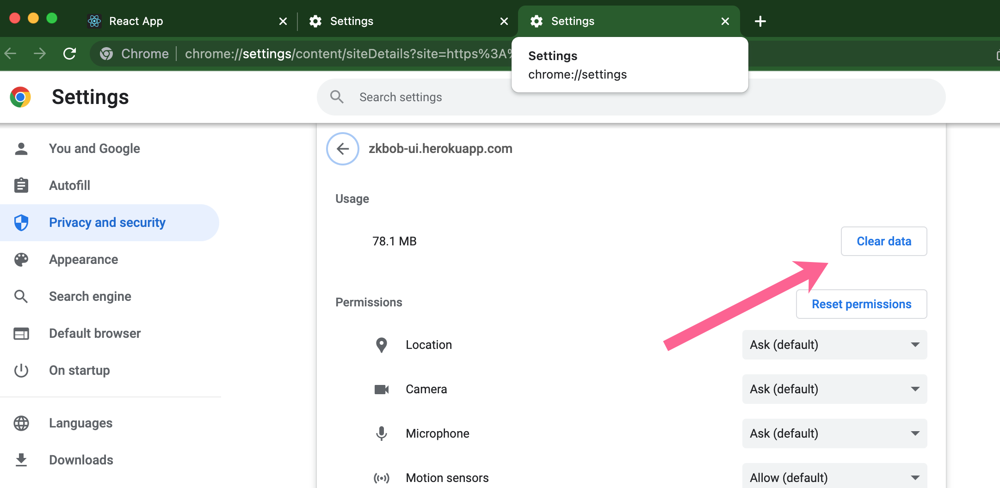

# FAQ

## Who should use zkBob?

Users should first check their jurisdiction and [make sure they are in compliance](compliance.md) - zkBob is not available to users in some countries.

The blockchain provides a transparent ledger of all transactions that have occurred since the genesis of the chain. This transparency is an important feature and useful in many cases. Sometimes, however, you may want to safeguard sensitive financial information.

Digital wallets (accounts) are holding more information than ever thanks to the popularity of NFTs. This can make it easy to identify a lot of information about a particular wallet address and its owner, including net worth, conferences and meetups attended (POAPs), group involvement, and other information. Just as in real-world interactions, you may not want to announce your net worth to everyone within earshot or let any stranger view the contents of your bank account or rifle through the wallet in your back pocket.&#x20;

In the offline world, cash can be used for financial privacy. In the blockchain space, zk-based "digital cash" transactions can offer similar anonymity.

Some users of zkBob may include:

* Large cryptocurrency holders who want to protect their identity and reduce possible targeting by cyber criminals.
* Business owners who do not want to divulge vendor addresses, prices they paid for items, or other business transactions that can put them at competitive risk.
* Everyday users who want a "digital cash" option to transfer and trade with one another privately through a shielded pool.&#x20;
* Philanthropists who want to donate to causes anonymously.
* Individuals interested in privacy, zksnarks, or novel auction mechanisms related to [XP functionality](../in-development/xp/).

## Who should not use zkBob?

Users is countries where zkBob is prohibited should not use zkBob. Please check the [Compliance section](compliance.md).

zkBob should not be used for any illegitimate or criminal activity. It should not be used in any way that violates any laws in the jurisdiction of the user, and should not be used by politically exposed individuals or associates of those individuals. Prior to using zkBob, you must acknowledge and accept these terms of usage:

* If acting as an individual you are of legal age (as applicable in the jurisdiction where you live).
* You are not a politically exposed person, that is, a person who is entrusted with any prominent public function, or a politically exposed person who has stepped down from that role.
* You are not an immediate family member or close associate of a politically exposed person or a politically exposed person who has stepped down.
* You are not engaged in money laundering or the financing of terrorism.
* Your access to the application does not violate any rule, law, regulation or directive of the country of your residence and the jurisdiction in which you reside.
* You have not been arrested or convicted of any offence or crime.
* You are willing to provide and verify your identity upon request.

## Is the code open-source?

The underlying code is open-source and anyone can deploy contracts, a relayer, and a cli to perform basic operations. The UI is not currently open-source to avoid simple clones. Code is available at [https://github.com/zkbob](https://github.com/zkbob)

## How long should I keep my tokens in a zkBob anonymity pool to ensure privacy?

It depends on how large the pool set is and how much activity has happened since your deposit. Looking at the number of deposits since your deposit can provide a rough estimation of safety (though not complete because it does not account for transfers within the protocol). In general, the longer you wait to withdraw (several days minimum), the better.&#x20;

## Why are there multiple accounts?

There are 2 different types of accounts displayed in the interface. One is for transferring funds **to and from zkBob (Wallet account)** and the second is for transferring funds **within zkBob (zkAccount)**.

.png>)

1. **Wallet Account**. This is a standard EOA (Externally owned address) you can connect to fund or withdraw from your zkAccount. It can also be used to generate a zkAccount using the private key from the EOA.&#x20;
2. **zkAccount.** This is the shielded account where you can transact privately with other zkAccount holders. It is auto-named starting with zk (in the example below account name is zkGerti). [More on zkAccounts](../implementation/account-and-notes/accounts.md).

## What is the difference between an account and an address?

\-> **Accounts** are used to perform actions with zkBob. You may use an EOA wallet account to deposit or withdraw, and your zkBob account to initiate deposits, withdrawals, transfers, or view your transaction history.&#x20;

\-> **Addresses** are used for shielded token transfers between users in zkBob. Ideally, a new address is generated for each transfer. It is not possible to link different private addresses to one another or to the primary account. Only the account owner can confirm ownership. Each created address is encoded in base58 format.

Learn more about [generating a receiving address here.](../using-zkbob/zkbob-app/generate-a-secure-address.md)

## I generated a new zkBob address, will my old one still work?

Yes, it will still work. You can generate as many addresses as you would like. Each one is encrypted and cannot be connected to one another or to the primary account except by the account owner, and each one will work indefinitely.

## What if I lose my password?

You can restore your account using your original seed phrase. Once restored, you will be asked to generate a new password.

## Why do I keep having to enter my password?

Encrypted data is stored in local storage for safety purposes. When the app is refreshed from the browser, the password is needed to decrypt the locally-stored account data. A built-in refresh function lets you update history and balance without needing to refresh the entire application. This is useful to view your current zkaccount state once a transaction has been processed on-chain.&#x20;

The in-app refresh, located next to your zkaccount name, should be used rather than a 'hard refresh' to avoid password re-entry.

## Why is my transaction taking almost a minute to process?

Several processes are required for a successful transaction. Proof generation takes place on the client side and is typically a 10 second process. Transactions are then processed in parallel rather than sequentially through the relayer, which optimizes the zkBob application. However, once a transaction is submitted to the chain, timing can be variable based on blockchain congestion, resulting in some longer transaction times.

### Related: I just sent a transaction on zkBob. Why do I have to wait to perform another deposit/transfer/withdrawal?

For safety purposes and to prevent potential double-spend scenarios, the application waits until a transaction is confirmed before another transaction can be initiated.

## Can the zkBob protocol be compromised and my information made available?

With zkproof transactions specific identifying information is never recorded (such as sender, receiver and amount sent) so it is not possible to connect these bits of information within zkBob. However, there are other ways your information may be compromised. To maintain privacy, be aware of the following.

* **Seed phrase / private key discovery**: Never write a seed phrase on any internet-connected device. Do not take a screenshot of it. Do not copy and paste it anywhere. Write it on a physical piece of paper and keep somewhere secure.
* **Ip-tracing**: Internet service providers collect logs that can show all ip addresses that connected to an application, including zkBob.&#x20;
* **Transaction inference:** Depositing a specific amount of tokens and then withdrawing that exact amount (especially unconventional amounts in a short timeframe) can create a compelling case for connection. It is recommended to withdraw different amounts that amounts deposited, and to ideally keep funds in the pool for longer periods of time to provide more privacy.&#x20;
* **Address trail:** Using same generated address for transactions with many different parties creates a connection string which can compromise privacy. It is best to generate a new address for each transfer within the application.
* **Secure address messaging**:  When sending a generated address to another party, carefully choose the application you use (ie Slack, telegram, etc).  It is best to choose a secure and private channel.
* **Withdrawals**: When withdrawing from the application, sending to a newly generated address without a prior transaction history is the most private method.

## I can't connect to my account, what should I do?

If you have entered the correct information but your account is not loading you can try clearing the cache and storage. Version updates can sometimes result in artifacts that must be cleared for the latest version to work.&#x20;

Chrome / Firefox are the recommended browsers for the zkBob UI, the following are instructions for refreshing the zkBob app in Chrome.\
\
1\) Open the developer console. \
`Ctrl` `Shift` `J` (Windows)  \
`Cmd` `Option` `J` (Mac)

or in the Chrome menu go to View -> Developer -> Developer Tools

2\) With dev tools open, **right click** the reload symbol and select **Empty Cache and Hard Reload**.

.png>)


If this doesn't fix the issue, proceed to clear site data. **Note this process will clear all local storage and require you to reenter your seed phrase. If you do not have it your account information will be unrecoverable.**


3\) Right click the lock🔒 icon and select **Site Settings**.

4\) Click the **Clear Data** button.

5\) Restore your previous account with your seed phrase and create a new password to re-enter the application.

