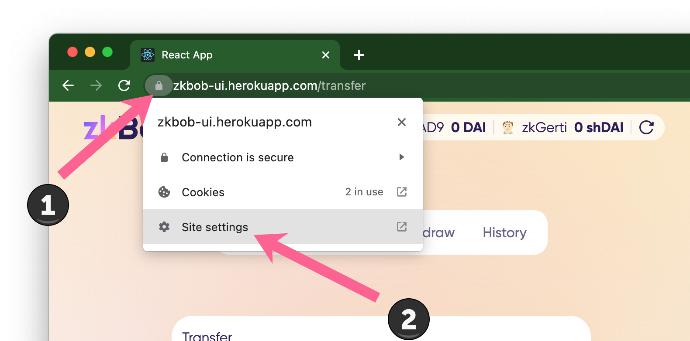

# FAQ

## How long should I keep my funds in the anonymity pool to ensure privacy?

\-> It depends on how large the pool set is and how much activity has happened since your deposit. Looking at the number of deposits since your deposit can provide a rough estimation of safety (though not complete because it does not account for transfers within the protocol). In general, the longer you wait to withdraw (several days minimum), the better.&#x20;

## Is the code open-source?

\-> The underlying code is open-source and anyone can deploy contracts, a relayer, and a cli to perform basic operations. The UI is not currently open-source to avoid simple clones. Code is available at [https://github.com/zkbob](https://github.com/zkbob)

## Why are there multiple accounts?

\-> There are 2 different types of accounts displayed in the interface. One is for transferring funds **to and from zkBob (Wallet account)** and the second is for transferring funds **within zkBob (zkAccount)**.

.png>)

1. **Wallet Account**. This is a standard EOA (Externally owned address) you can connect to fund or withdraw from your zkAccount. It can also be used to generate a zkAccount using the private key from the EOA.&#x20;
2. **zkAccount.** This is the shielded account where you can transact privately with other zkAccount holders. It is auto-named starting with zk (in the example below account name is zkGerti). [More on zkAccounts](../implementation/account-and-notes/accounts.md).

## What is the difference between an account and an address?

\-> **Accounts** are used to perform actions with zkBob. You may use an EOA wallet account to deposit or withdraw, and your zkBob account to initiate deposits, withdrawals, transfers, or view your transaction history.&#x20;

\-> **Addresses** are used for shielded token transfers between users in zkBob. Ideally, a new address is generated for each transfer. It is not possible to link different private addresses to one another or to the primary account. Only the account owner can confirm ownership. Each created address is encoded in base58 format.

Learn more about [generating a receiving address here.](../zkbob-getting-started/zkbob-app/generate-a-secure-address.md)

## I generated a new zkBob address, will my old one still work?

\-> Yes, it will still work. You can generate as many addresses as you would like. Each one is encrypted and cannot be connected to one another or to the primary account except by the account owner, and each one will work indefinitely.

## What if I lose my password?

\-> You can restore your account using your original seed phrase. Once restored, you will be asked to generate a new password.

## Can the protocol be compromised and my information made available?

\-> With zkproof transactions specific identifying information is never recorded (such as sender, receiver and amount sent) so it is not possible to connect these bits of information within zkBob. However, there are other ways your information may be compromised. To maintain privacy, be aware of the following.

* **Seed phrase / private key discovery**: Never write a seed phrase on any internet-connected device. Do not take a screenshot of it. Do not copy and paste it anywhere. Write it on a physical piece of paper and keep somewhere secure.
* **Ip-tracing**: Internet service providers collect logs that can show all ip addresses that connected to an application, including zkBob. VPNs, TOR, or proxy servers might be used to preserve your privacy.&#x20;
* **Transaction inference:** Depositing a specific amount of tokens and then withdrawing that exact amount (especially unconventional amounts in a short timeframe) can create a compelling case for connection. It is recommended to withdraw different amounts that amounts deposited, and to ideally keep funds in the pool for longer periods of time to provide more privacy.&#x20;
* **Address trail:** Sending the same generated address to many different parties can create a connection string which may compromise privacy. It is best to generate a new address for each transfer within the application.&#x20;
* **Clean withdrawals**: When withdrawing from the application, sending to a newly generated address without a prior transaction history is the most private method.

## I can't connect to my account, what should I do?

If you have entered the correct information but your account is not loading you can try clearing the cache and storage. Version updates can sometimes result in artifacts that must be cleared for the latest version to work.

Chrome / Firefox are the recommended browsers for the zkBob UI, the following are instructions for refreshing the zkBob app in Chrome.\
\
1\) Open the developer console. \
`Ctrl` `Shift` `J` (Windows)  \
`Cmd` `Option` `J` (Mac)

or in the Chrome menu go to View -> Developer -> Developer Tools

2\) With dev tools open, **right click** the reload symbol and select **Empty Cache and Hard Reload**.

.png>)


If this doesn't fix the issue, proceed to clear site data. Note this will remove all local data and you will need your seed phrase to reset your account.


3\) Right click the lock🔒 icon and select **Site Settings**.

4\) Click the **Clear Data** button.

5\) Restore your previous account with your seed phrase and create a new password to re-enter the application.

